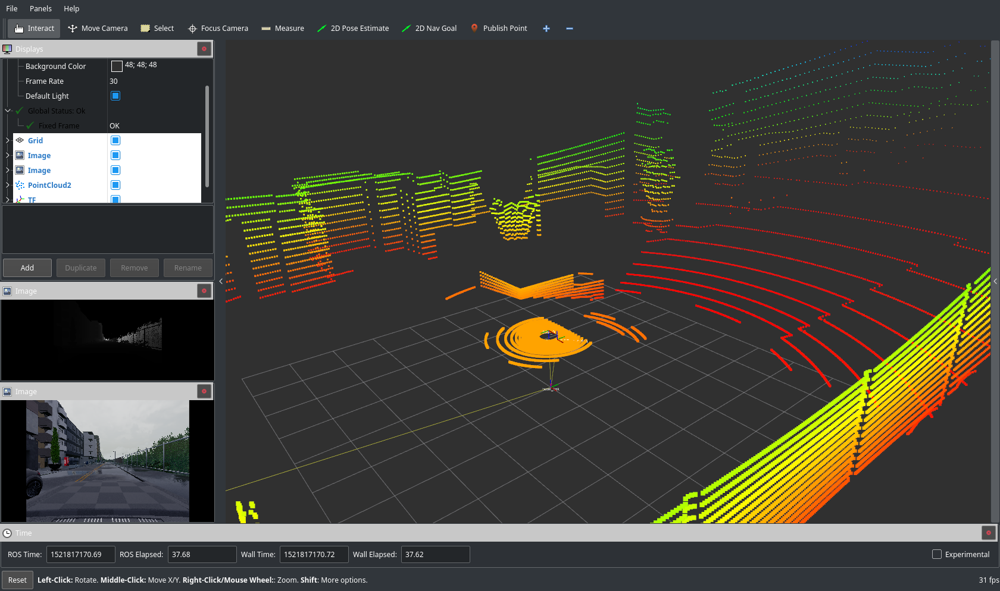

# Ros bridge for Carla simulator

This ros package aims at providing a simple ros bridge for carla simulator.

# Features

- [x] Cameras (depth, segmentation, rgb) support
- [x] Transform publications
- [x] Manual control using ackermann msg
- [x] Handle ros dependencies
- [x] Marker/bounding box messages for cars/pedestrian
- [ ] Rosbag in the bridge (in order to avoid rosbag recoard -a small time errors)
- [ ] Lidar sensor support
- [ ] Add traffic light support

# Setup

## Create a catkin workspace and install carla_ros_bridge package

### Create the catkin workspace:

    mkdir -p ~/ros/catkin_ws_for_carla/src
    cd ~/ros/catkin_ws_for_carla
    source /opt/ros/kinetic/setup.bash
    catkin_make
    source ~/ros/catkin_ws_for_carla/devel/setup.bash

For more information about configuring a ros environment see
http://wiki.ros.org/ROS/Tutorials/InstallingandConfiguringROSEnvironment

## Install carla python client API in your workspace

    cd carla/PythonAPI
    pip2 install -e .  --user --upgrade

Check the installation is successfull by trying to import carla from python:

    python -c 'import carla;print("Success")'

You should see the Success message without any errors.

### Install recent protobuf version [optional]

    sudo apt-get remove python-protobuf
    sudo pip2 install --upgrade protobuf

### Add the carla_ros_bridge in the catkin workspace

Run the following command after replacing [PATH_TO_ROS_BRIDGE] with the actual path to carla ros bridge directory on your machine:

    ln -s [PATH_TO_ROS_BRIDGE]/carla_ros_bridge/ ~/ros/catkin_ws_for_carla/src/
    source ~/ros/catkin_ws_for_carla/devel/setup.bash
    rosdep update
    rosdep install --from-paths ~/ros/catkin_ws_for_carla
    cd ~/ros/catkin_ws_for_carla
    catkin_make
    source ~/ros/catkin_ws_for_carla/devel/setup.bash

### Test your installation (section outdated)

If you use the builded binary (0.8.2):

     ./CarlaUE4.sh  -carla-server -windowed -ResX=320 -ResY=240

Wait for the message:

    Waiting for the client to connect...

Then run the tests

    rostest carla_ros_bridge ros_bridge_client.test

you should see:

    [carla_ros_bridge.rosunit-testTopics/test_publish][passed]

    SUMMARY
     * RESULT: SUCCESS

# Start the ros bridge

First run the simulator (see carla documentation: http://carla.readthedocs.io/en/latest/)

     ./CarlaUE4  -carla-server -windowed -ResX=320 -ResY=240

Wait for the message:

    Waiting for the client to connect...

Then start the ros bridge:

    source ~/ros/catkin_ws_for_carla/devel/setup.bash
    roslaunch carla_ros_bridge client.launch

To start the ros bridge with rviz use:

    roslaunch carla_ros_bridge client_with_rviz.launch

You can setup the vehicle wanted to used as ego vehicle in config/settings.yaml.

Then you can make use of the CARLA python API scripts manual_control.py. This spawns a vehicle with role_name='hero' which is interpreted
as the ego vehicle as defined by the config/settings.yaml.

You can then further spawn other vehicles using spawn_npc.py from CARLA python API. Then those vehicles will show up also on ROS side.

# Test control messages
You can send command to the car using the /carla/ego_vehicle/ackermann_cmd topic.

Example of forward movements, speed in in meters/sec.

     rostopic pub /carla/ego_vehicle/ackermann_cmd ackermann_msgs/AckermannDrive "{steering_angle: 0.0, steering_angle_velocity: 0.0, speed: 10, acceleration: 0.0,
      jerk: 0.0}" -r 10

Example of forward with steering

     rostopic pub /carla/ego_vehicle/ackermann_cmd ackermann_msgs/AckermannDrive "{steering_angle: 5.41, steering_angle_velocity: 0.0, speed: 10, acceleration: 0.0,
      jerk: 0.0}" -r 10

  Warning: the steering_angle is the driving angle (in radians) not the wheel angle, for now max wheel is set to 500 degrees.

Example for backward :

     rostopic pub /carla/ego_vehicle/ackermann_cmd ackermann_msgs/AckermannDrive "{steering_angle: 0, steering_angle_velocity: 0.0, speed: -10, acceleration: 0.0,
      jerk: 0.0}" -r 10

# Test sensor messages

## Object information

### Ego vehicle

The ego vehicle status is provided via the topic /carla/ego_vehicle/odometry (nav_msgs.Odometry)

### Other vehicles

The other vehicles data is provided via the 'ideal' object list /carla/objects (derived_object_msgs.ObjectArray)

## Map information

The OPEN Drive map description is published via /map topic (std_msgs.String)

## Sensor information

### Ego vehicle
The ego Vehicle sensors are provided via topics with prefix /carla/ego_vehicle/<sensor_topic>

# ROSBAG recording (not yet tested)

The carla_ros_bridge could also be used to record all published topics into a rosbag:

    roslaunch carla_ros_bridge client_with_rviz.launch rosbag_fname:=/tmp/save_session.bag

This command will create a rosbag /tmp/save_session.bag

You can of course also use rosbag record to do the same, but using the ros_bridge to do the recording you have the guarentee that all the message are saved without small desynchronization that could occurs when using *rosbag record* in an other process.

