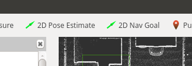

# ROS Reference Client

This package provides two ROS nodes:

- Carla Ego Vehicle: A reference client for spawning an ego vehicle
- Carla ROS Manual Control: a ROS-only manual control

## Carla Ego Vehicle

The reference Carla client `carla_ego_vehicle` can be used to spawn an ego vehicle (role-name: "ego_vehicle") with the following sensors attached to it.

- GNSS
- LIDAR
- Cameras (one front-camera + one camera for visualization in carla_ros_manual_control)
- Collision Sensor
- Lane Invasion Sensor

Info: To be able to use carla_ros_manual_control a camera with role-name 'view' is required.

If no specific position is set, the ego vehicle is spawned at a random position.

### Spawning at specific position

It is possible to (re)spawn the ego vehicle at the specific location by publishing to `/initialpose`.

The preferred way of doing that is using RVIZ:

Selecting a Pose with '2D Pose Estimate' will delete the current ego_vehicle and respawn it at the specified position.

## Carla ROS Manual Control

The node `carla_ros_manual_control` is a ROS-only version of the Carla `manual_control.py`. All data is received
via ROS topics.

Note: To be able to use carla_ros_manual_control a camera with role-name 'view' needs to be spawned by `carla_ego_vehicle`.

### Manual steering

In order to steer manually, you might need to disable sending vehicle control commands within another ROS node.

Therefore the manual control is able to publish to `/vehicle_control_manual_override` ([std_msgs/Bool](http://docs.ros.org/api/std_msgs/html/msg/Bool.html)).

Press `B` to toggle the value.

Note: As sending the vehicle control commands is highly dependent on your setup, you need to implement the subscriber to that topic yourself.

